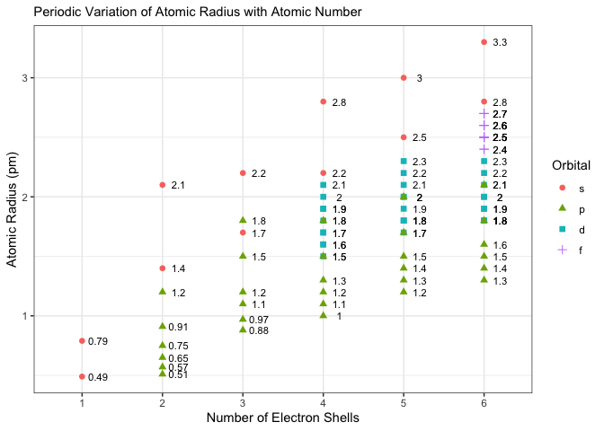
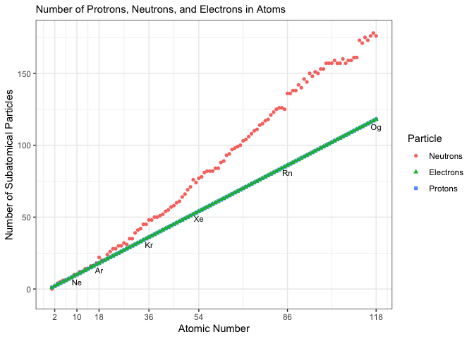

Data from data from
<https://gist.github.com/GoodmanSciences/c2dd862cd38f21b0ad36b8f96b4bf1ee>

    library(tidyverse)

    ## ── Attaching core tidyverse packages ──────────────────────── tidyverse 2.0.0 ──
    ## ✔ dplyr     1.1.4     ✔ readr     2.1.4
    ## ✔ forcats   1.0.0     ✔ stringr   1.5.1
    ## ✔ ggplot2   3.4.4     ✔ tibble    3.2.1
    ## ✔ lubridate 1.9.3     ✔ tidyr     1.3.0
    ## ✔ purrr     1.0.2     
    ## ── Conflicts ────────────────────────────────────────── tidyverse_conflicts() ──
    ## ✖ dplyr::filter() masks stats::filter()
    ## ✖ dplyr::lag()    masks stats::lag()
    ## ℹ Use the conflicted package (<http://conflicted.r-lib.org/>) to force all conflicts to become errors

    library(stringr)

    df <- read.csv("https://gist.githubusercontent.com/GoodmanSciences/c2dd862cd38f21b0ad36b8f96b4bf1ee/raw/1d92663004489a5b6926e944c1b3d9ec5c40900e/Periodic%2520Table%2520of%2520Elements.csv")

    head(df)

    ##   AtomicNumber   Element Symbol AtomicMass NumberofNeutrons NumberofProtons
    ## 1            1  Hydrogen      H      1.007                0               1
    ## 2            2    Helium     He      4.002                2               2
    ## 3            3   Lithium     Li      6.941                4               3
    ## 4            4 Beryllium     Be      9.012                5               4
    ## 5            5     Boron      B     10.811                6               5
    ## 6            6    Carbon      C     12.011                6               6
    ##   NumberofElectrons Period Group Phase Radioactive Natural Metal Nonmetal
    ## 1                 1      1     1   gas                 yes            yes
    ## 2                 2      1    18   gas                 yes            yes
    ## 3                 3      2     1 solid                 yes   yes         
    ## 4                 4      2     2 solid                 yes   yes         
    ## 5                 5      2    13 solid                 yes               
    ## 6                 6      2    14 solid                 yes            yes
    ##   Metalloid                 Type AtomicRadius Electronegativity FirstIonization
    ## 1                       Nonmetal         0.79              2.20         13.5984
    ## 2                      Noble Gas         0.49                NA         24.5874
    ## 3                   Alkali Metal         2.10              0.98          5.3917
    ## 4           Alkaline Earth Metal         1.40              1.57          9.3227
    ## 5       yes            Metalloid         1.20              2.04          8.2980
    ## 6                       Nonmetal         0.91              2.55         11.2603
    ##    Density MeltingPoint BoilingPoint NumberOfIsotopes  Discoverer Year
    ## 1 8.99e-05       14.175        20.28                3   Cavendish 1766
    ## 2 1.79e-04           NA         4.22                5     Janssen 1868
    ## 3 5.34e-01      453.850      1615.00                5   Arfvedson 1817
    ## 4 1.85e+00     1560.150      2742.00                6  Vaulquelin 1798
    ## 5 2.34e+00     2573.150      4200.00                6  Gay-Lussac 1808
    ## 6 2.27e+00     3948.150      4300.00                7 Prehistoric   NA
    ##   SpecificHeat NumberofShells NumberofValence
    ## 1       14.304              1               1
    ## 2        5.193              1              NA
    ## 3        3.582              2               1
    ## 4        1.825              2               2
    ## 5        1.026              2               3
    ## 6        0.709              2               4

    df2 <- df %>%
      mutate(Orbital = ifelse(NumberofValence == "NA", "NA",
                              ifelse(NumberofValence < 3, "s",
                                     ifelse(NumberofValence < 9, "p", "?"))),
             Orbital = ifelse(AtomicNumber < 71 & AtomicNumber > 56, "f",  Orbital),
             Orbital = ifelse(AtomicNumber < 31 & AtomicNumber > 20, "d",  Orbital),
             Orbital = ifelse(AtomicNumber < 49 & AtomicNumber > 38, "d",  Orbital),
             Orbital = ifelse(AtomicNumber < 81 & AtomicNumber > 70, "d",  Orbital),
             Orbital = factor(Orbital, levels = c("s", "p", "d", "f")),
             Orbital = fct_na_value_to_level(Orbital, "s")) %>%
      select(AtomicNumber:AtomicMass, AtomicRadius, NumberofShells, NumberofValence, Orbital, FirstIonization) %>%
      mutate(Label = as.numeric(ifelse(NumberofValence == 1, NumberofShells, ""))) %>%
      drop_na(AtomicRadius) 

    head(df2)

    ##   AtomicNumber   Element Symbol AtomicMass AtomicRadius NumberofShells
    ## 1            1  Hydrogen      H      1.007         0.79              1
    ## 2            2    Helium     He      4.002         0.49              1
    ## 3            3   Lithium     Li      6.941         2.10              2
    ## 4            4 Beryllium     Be      9.012         1.40              2
    ## 5            5     Boron      B     10.811         1.20              2
    ## 6            6    Carbon      C     12.011         0.91              2
    ##   NumberofValence Orbital FirstIonization Label
    ## 1               1       s         13.5984     1
    ## 2              NA       s         24.5874    NA
    ## 3               1       s          5.3917     2
    ## 4               2       s          9.3227    NA
    ## 5               3       p          8.2980    NA
    ## 6               4       p         11.2603    NA

    ggplot(df2, aes(x = AtomicNumber, y = AtomicRadius,
                    label = Label ), na.rm) +
      geom_line(color = "grey") +
      geom_point(aes(color = Orbital)) +
      labs(y = "Atomic Radius (pm)",
           x = "Atomic Number\n(Numbers above points represent shell numbers.)",
           subtitle = "Periodic Variation of Atomic Radius with Atomic Number") +
      theme_bw() +
      geom_text(nudge_y = 0.1) +
      xlim(0, 87) +
      scale_x_continuous(breaks = c(2,10,18,36,54,86)) 

    ## Scale for x is already present.
    ## Adding another scale for x, which will replace the existing scale.

    ## Warning: Removed 80 rows containing missing values (`geom_text()`).

    ggplot(df2, aes(x = AtomicNumber, y = FirstIonization,
                    label = Label ), na.rm) +
      geom_line(color = "grey") +
      geom_point(aes(color = Orbital)) +
      labs(x = "Atomic Number",
           y = " Ionization Energy\n(Numbers above points represent shell numbers.)",
           subtitle = "Periodic Variation in Ionization with Atomic Number") +
      theme_bw() 

    ggplot(df2, aes(x = AtomicRadius, y = FirstIonization, 
                    label = Label ), na.rm) +
      geom_line(color = "grey") +
      geom_point(aes(color = Orbital)) +
      labs(x = "Atomic Radius (pm)",
           y = " Ionization Energy\n(Numbers above points represent shell numbers.)",
           subtitle = "Variation of Atomic Radius and Ionization Energy") +
      theme_bw() 

    ggplot(df2, aes(x = as.factor(NumberofShells), y = AtomicRadius, label = AtomicRadius)) +
      #geom_boxplot(aes(color = Orbital)) +
      geom_point(aes(color = Orbital, shape = Orbital),
                 size = 2)  +
      labs(y = "Atomic Radius (pm)",
           x = "Number of Electron Shells",
           subtitle = "Periodic Variation of Atomic Radius with Atomic Number") +
      theme_bw() +
      geom_text(size = 3, nudge_x = 0.2)

    df3 <- df %>%
      select(AtomicNumber, Symbol, Element, NumberofValence, AtomicMass,
             NumberofNeutrons:NumberofElectrons) %>%
      pivot_longer(cols = AtomicMass:NumberofElectrons, 
                   names_to = "Particle", 
                   values_to = "Value") %>%
      filter(Particle != "AtomicMass") %>%
      mutate(Particle = factor(Particle, levels = c( "NumberofNeutrons", "NumberofElectrons", "NumberofProtons")),
             Particle = fct_recode(Particle,
                                   "Electrons" = "NumberofElectrons",
                                    "Neutrons" = "NumberofNeutrons",
                                   "Protons" = "NumberofProtons"),
             myLabel = ifelse(NumberofValence == 8 & Particle == "Protons", Symbol, ""))

    head(df3)

    ## # A tibble: 6 × 7
    ##   AtomicNumber Symbol Element  NumberofValence Particle  Value myLabel
    ##          <int> <chr>  <chr>              <int> <fct>     <dbl> <chr>  
    ## 1            1 H      Hydrogen               1 Neutrons      0 ""     
    ## 2            1 H      Hydrogen               1 Protons       1 ""     
    ## 3            1 H      Hydrogen               1 Electrons     1 ""     
    ## 4            2 He     Helium                NA Neutrons      2 ""     
    ## 5            2 He     Helium                NA Protons       2 <NA>   
    ## 6            2 He     Helium                NA Electrons     2 ""

    ggplot(df3, aes(x = AtomicNumber, y = Value, label = myLabel)) +
      geom_point(aes(color = Particle, shape = Particle)) +
      labs(x = "Atomic Number",
           y = "Number of Subatomical Particles",
           subtitle = "Number of Protrons, Neutrons, and Electrons in Atoms") +
      theme_bw() +
      scale_x_continuous(breaks = c(2,10,18,36,54,86,118)) +
      geom_text(size = 3, nudge_y = -5)

    ## Warning: Removed 69 rows containing missing values (`geom_text()`).

    write.csv(df, file = "periodictable.csv", quote = F,append = F)

    ## Warning in write.csv(df, file = "periodictable.csv", quote = F, append = F):
    ## attempt to set 'append' ignored

    write.csv(df2, file = "periodictrends_2.csv", quote = F,append = F)

    ## Warning in write.csv(df2, file = "periodictrends_2.csv", quote = F, append =
    ## F): attempt to set 'append' ignored

    df4 <- df %>%
      select(Symbol, AtomicNumber, AtomicMass, NumberofProtons, NumberofNeutrons, NumberofElectrons, Element, Period, Phase, Type, NumberofShells, AtomicRadius:BoilingPoint, SpecificHeat, Discoverer, Year) %>%
      mutate(Discoverer = str_replace_all(Discoverer, ",", "."))

    write.csv(df4, file = "periodic_table.csv", quote = F, row.names = F)
